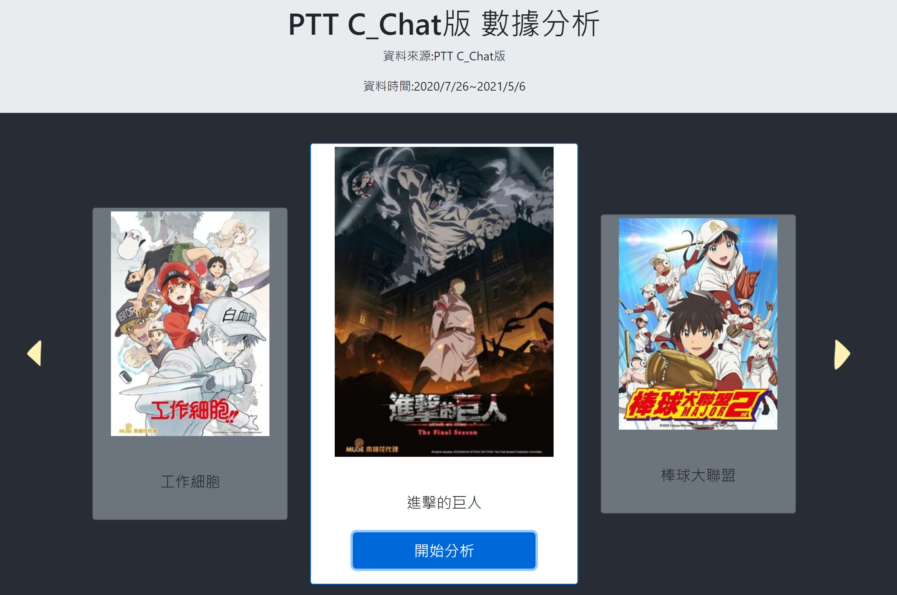
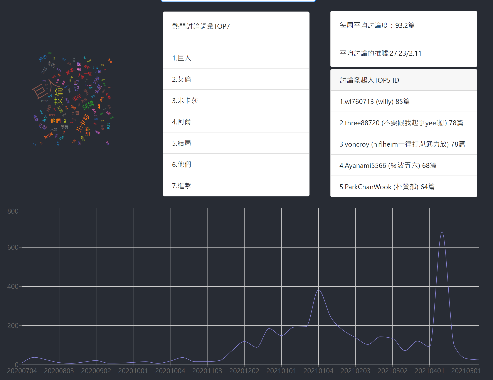

# CChatAnalyze  
這是第一個自己結合前端(React)和後端(Node.js)的作品  
並且成功發布到heroku  
主要Data來源是PTT的CChat版2020/7/26~2021/5/6的文章  
有做文字雲和資料的篩選  
也有畫成圖表  
大致上最上端可以挑選自己想分析的作品  
按下開始分析後，下方就會跑出結果   
  
  
雖然很高興有這份作品，但老實說他有很多需要改進的地方  
比如後端讀檔的效能  
前端應改成RWD等等  
希望接下來再接再勵！  
